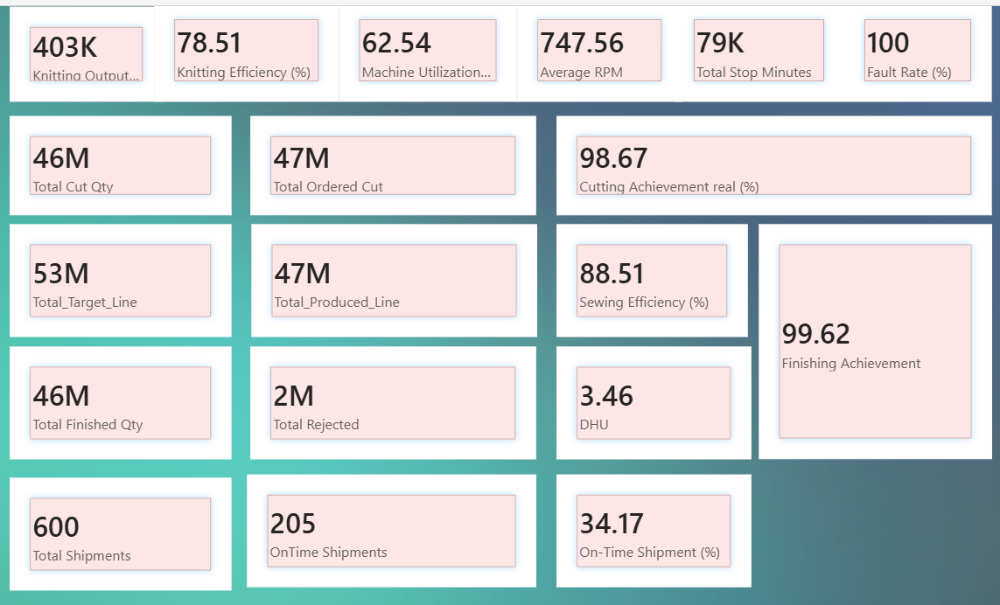
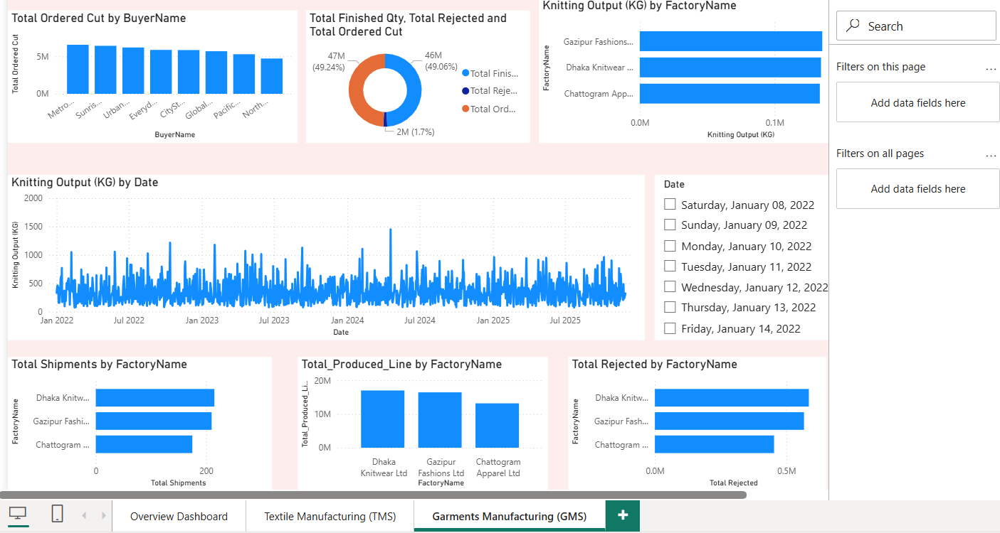
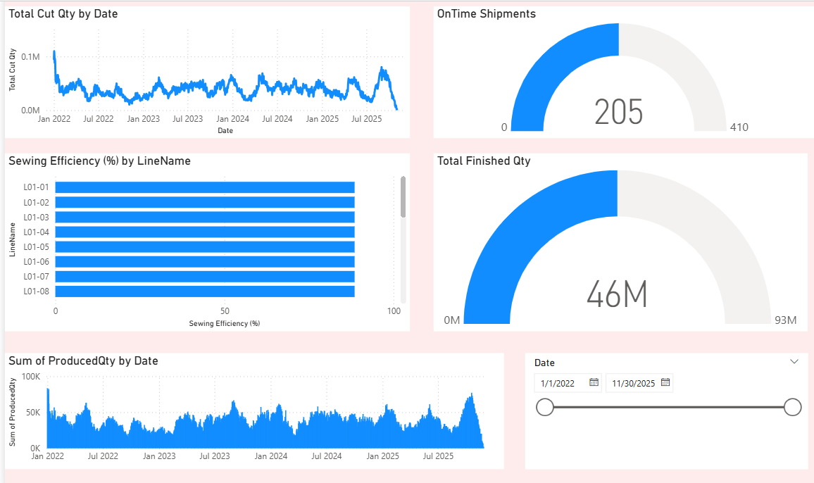

# 🏭 RMG Production Analytics Dashboard
### Power BI — Textile & Garment Manufacturing Intelligence

> **A multi-page interactive Power BI dashboard analyzing end-to-end production performance across Textile Manufacturing (TMS) and Garments Manufacturing (GMS) — covering knitting output, cutting, sewing efficiency, quality control, and shipment tracking from January 2022 to November 2025.**

---

## 📸 Dashboard Screenshots

### 🔷 Overview Dashboard — KPI Summary



---

### 🧶 Textile Manufacturing (TMS) — Garments Manufacturing (GMS)



---

### ✂️ Textile Manufacturing — Production Detail



---

## 📌 Project Overview

This dashboard covers the full **RMG (Ready-Made Garments) production pipeline** — from raw knitting output through cutting, sewing, finishing, and final shipment. It monitors **3 major factories** across Bangladesh with **4 years of daily production data**.

| 📅 Date Range | 🏭 Factories | 📦 Total Shipments | ⏱️ On-Time Shipments |
|:---:|:---:|:---:|:---:|
| Jan 2022 – Nov 2025 | 3 | 600 | 205 (34.17%) |

---

## 🗂️ Dashboard Pages

### Page 1 — 📊 Overview Dashboard
A high-level KPI summary of the entire operation — the "single glance" view for executives and managers.


| KPI | Value |
|---|:---:|
| Knitting Output | 403K KG |
| Knitting Efficiency | 78.51% |
| Machine Utilization | 62.54% |
| Average RPM | 747.56 |
| Total Stop Minutes | 79K |
| Fault Rate | 100% |
| Total Cut Qty | 46M |
| Total Ordered Cut | 47M |
| Cutting Achievement | 98.67% |
| Total Target Line | 53M |
| Total Produced Line | 47M |
| Sewing Efficiency | 88.51% |
| Total Finished Qty | 46M |
| Total Rejected | 2M |
| DHU | 3.46 |
| Finishing Achievement | 99.62% |
| Total Shipments | 600 |
| On-Time Shipments | 205 |
| On-Time Shipment % | 34.17% |

---

### Page 2 — 🧶 Garments Manufacturing (GMS)
Factory-level breakdown of cutting, production, shipments, rejection, and knitting output over time.


**Visuals Included:**
- 📊 Total Ordered Cut by BuyerName — 8 buyers including Metro, Sunrise, Urban, EveryD, CitySt, Global, Pacific, North
- 🍩 Total Finished Qty vs Total Rejected vs Total Ordered Cut (Donut)
  - Total Finished: 47M (49.24%)
  - Total Ordered: 46M (49.06%)
  - Total Rejected: 2M (1.7%)
- 📊 Knitting Output (KG) by FactoryName
- 📈 Knitting Output (KG) by Date — Jan 2022 to Jul 2025 (daily trend)
- 📊 Total Shipments by FactoryName
- 📊 Total Produced Line by FactoryName
- 📊 Total Rejected by FactoryName

**Factories Monitored:**
| Factory | Shipments | Production | Rejection |
|---|:---:|:---:|:---:|
| Dhaka Knitwear Ltd | Highest | ~20M | Highest |
| Gazipur Fashions Ltd | Medium | ~15M | Medium |
| Chattogram Apparel Ltd | Lowest | ~10M | Lowest |

---

### Page 3 — ✂️ Textile Manufacturing (TMS)
Sewing line efficiency, production output, and shipment performance tracking.


**Visuals Included:**
- 📈 Total Cut Qty by Date (Jan 2022 – Nov 2025)
- 🔵 OnTime Shipments Gauge — **205 out of 410 target**
- 📊 Sewing Efficiency (%) by LineName — Lines L01-01 through L01-08
- 🔵 Total Finished Qty Gauge — **46M out of 93M target**
- 📈 Sum of ProducedQty by Date (Jan 2022 – Nov 2025)
- 📅 Date Slicer — 1/1/2022 to 11/30/2025

---

## 🔑 Key KPIs Explained

| KPI | Definition | Value |
|---|---|:---:|
| **Knitting Efficiency** | Actual output vs target output in knitting | 78.51% |
| **Machine Utilization** | % of time machines are actively running | 62.54% |
| **Cutting Achievement** | Actual cut qty vs ordered cut qty | 98.67% |
| **Sewing Efficiency** | Actual sewing output vs target | 88.51% |
| **DHU** | Defects per Hundred Units — lower is better | 3.46 |
| **Finishing Achievement** | % of finishing target met | 99.62% |
| **On-Time Shipment %** | Orders shipped on time vs total shipments | 34.17% |
| **Fault Rate** | % of production with recorded faults | 100% |

---

## 🔍 Key Findings

| # | Finding | Impact |
|---|---|---|
| 1 | **On-Time Shipment rate is only 34.17%** — 205 out of 600 shipments | Critical risk — customers receiving late orders, reputation damage |
| 2 | **Machine Utilization at 62.54%** — over 1/3 of machine time is idle | Major efficiency gap — investigate stop reasons (79K stop minutes) |
| 3 | **Rejection rate = 2M out of 47M (1.7%)** — 2 million units scrapped | Quality cost — DHU of 3.46 indicates process quality issues |
| 4 | **Dhaka Knitwear Ltd leads** in production, shipments AND rejections | Highest volume = highest waste — needs quality intervention |
| 5 | **Cutting Achievement 98.67%** — nearly perfect | Cutting process is well-controlled — benchmark for other departments |
| 6 | **Finishing Achievement 99.62%** — near perfect | Finishing is the strongest performing stage in the pipeline |
| 7 | **Knitting output spike in early 2024** — peak at ~1,500 KG/day | Seasonal demand or special order — understand and replicate |
| 8 | **Total Produced Line (47M) below Target (53M)** — 11% gap | Production is consistently falling short of planned targets |

---

## 💡 Business Recommendations

| Priority | Recommendation |
|:---:|---|
| 🔴 **Critical** | On-time shipment at 34.17% is dangerously low — investigate delivery bottlenecks immediately |
| 🔴 **Critical** | 79K total stop minutes — identify top stop reasons and eliminate machine downtime |
| 🟡 **High** | Machine utilization at 62.54% — schedule preventive maintenance and optimize shift planning |
| 🟡 **High** | Dhaka Knitwear has highest rejections — implement stricter QC checks at that factory |
| 🟢 **Medium** | Replicate Cutting (98.67%) and Finishing (99.62%) best practices into Knitting and Sewing |
| 🟢 **Medium** | Production vs Target gap of 11% (47M vs 53M) — revise capacity planning |
| 🔵 **Strategy** | Investigate the early 2024 production spike — if seasonal, prepare inventory in advance |

---

## 🛠️ Technical Implementation

### Tools Used
| Tool | Purpose |
|---|---|
| **Power BI Desktop** | Dashboard development & visualization |
| **DAX** | Custom KPI measures and calculations |
| **Star Schema** | Data modeling for performance |
| **Power Query** | Data transformation & cleaning |

### DAX Measures Used
```dax
-- Knitting Efficiency
Knitting Efficiency (%) = DIVIDE([Actual Knitting Output], [Target Knitting Output]) * 100

-- Cutting Achievement
Cutting Achievement (%) = DIVIDE([Total Cut Qty], [Total Ordered Cut]) * 100

-- DHU (Defects per Hundred Units)
DHU = DIVIDE([Total Defects], [Total Checked]) * 100

-- On-Time Shipment %
On-Time Shipment (%) = DIVIDE([OnTime Shipments], [Total Shipments]) * 100

-- Sewing Efficiency
Sewing Efficiency (%) = DIVIDE([Actual Produced Line], [Total Target Line]) * 100

-- Finishing Achievement
Finishing Achievement (%) = DIVIDE([Total Finished Qty], [Total Ordered Cut]) * 100
```

### Data Model (Star Schema)
```
FactProduction ──→ DimFactory
      │        ──→ DimDate
      │        ──→ DimBuyer
      │        ──→ DimProduct
      └───────→ DimLine
```

---

## 📁 Project Structure

```
RMG-Production-Analytics/
│
├── README.md                              ← You are here
│
├── screenshots/
│   ├── Overview_Dashboard.png             ← KPI summary page
│   ├── Garments_Manufacturing__GMS_.png   ← GMS detail page
│   └── Textile_Manufacturing__TMS_.png    ← TMS detail page
│
└── RMG_Production_Dashboard.pbix          ← Power BI file
```

---

## ⚙️ How to Use

1. Download `RMG_Production_Dashboard.pbix`
2. Open in **Power BI Desktop** (free download from Microsoft)
3. Navigate between 3 pages using tabs at the bottom:
   - **Overview Dashboard** — executive KPI summary
   - **Textile Manufacturing (TMS)** — sewing & production detail
   - **Garments Manufacturing (GMS)** — factory & buyer detail
4. Use **Date slicer** (Jan 2022 – Nov 2025) to filter time periods
5. Use **Department** and **Factory** filters to drill into specific data

---

## 📊 Dashboard Features

| Feature | Description |
|---|---|
| ✅ Interactive Slicers | Filter by Date, Factory, Department, Pay Grade |
| ✅ KPI Cards | 18 real-time KPI metrics on overview page |
| ✅ Trend Analysis | Daily production trends from 2022–2025 |
| ✅ Gauge Charts | On-time shipment and finished qty vs target |
| ✅ Factory Comparison | Side-by-side factory performance benchmarking |
| ✅ Buyer Analysis | Ordered cut breakdown by 8 international buyers |
| ✅ Line Efficiency | Sewing efficiency per production line (L01-01 to L01-08) |
| ✅ Quality Monitoring | DHU, rejection rate, and fault tracking |

---

## 👤 About

This dashboard was built as a **Data Analyst Portfolio Project** to demonstrate skills in Power BI development, DAX calculations, manufacturing KPI design, and business insight generation for the RMG industry.

> *"In manufacturing, what gets measured gets improved. This dashboard makes every metric visible."*

---

⭐ **If you found this project helpful, please give it a star!**
